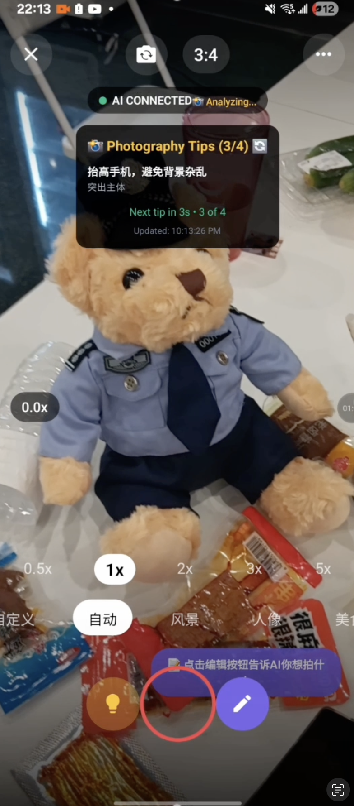
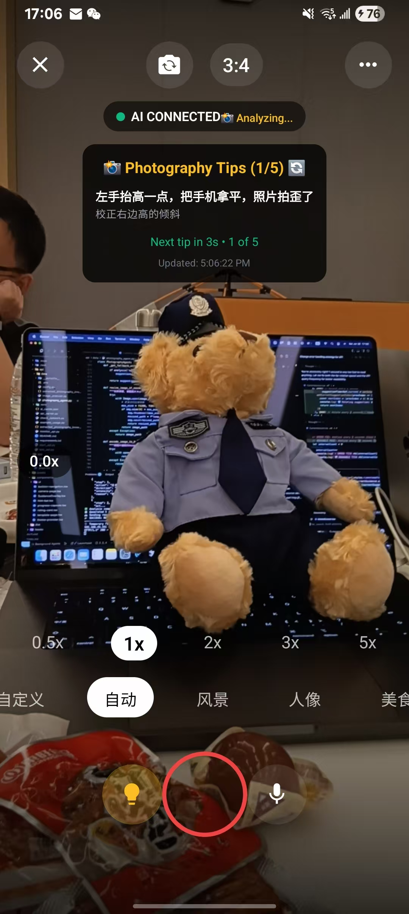

# PhotoLeo - 智能摄影助手

[](https://flutter.dev/)
[](https://reactnative.dev/)
[](https://nextjs.org/)
[](https://www.python.org/)
[](LICENSE)

PhotoLeo 是一个多平台智能摄影助手项目，集成了AI图像分析、实时摄影指导和语音交互功能。

> 🦁 **让每一张照片都成为艺术品** - PhotoLeo 是您的专业摄影助手，通过AI技术为您提供实时拍摄指导和智能分析。

## 项目架构

### 核心组件

1. **Flutter 移动应用** (`photomaster/`)
   - 跨平台移动应用，支持iOS和Android
   - 实时相机预览和图像分析
   - 语音交互和TTS功能
   - 构图辅助线和摄影指导

2. **React Native Web应用** (`photography-master-app_3/`)
   - 基于Next.js的Web应用
   - 响应式设计，支持移动端和桌面端
   - 现代化UI组件库
   - 相机集成和图像处理

3. **Python API服务** (`photography-master-app_3/api/`)
   - Flask后端服务
   - AI图像分析接口
   - 语音识别和合成
   - 摄影知识库集成

4. **前端组件库** (`frontend/`)
   - 可复用的React组件
   - 实时相机分析功能

## 技术栈

### 移动端 (Flutter)
- Flutter 3.7+
- Camera插件
- HTTP客户端
- 语音识别和合成
- 图像处理

### Web端 (React Native)
- Next.js 15
- React Native Web
- Expo Camera
- Tailwind CSS
- Radix UI组件

### 后端 (Python)
- Flask
- 图像分析AI
- 语音处理
- CORS支持

## 演示

### 应用截图

<div align="center">
  
  <p><em>智能相机界面 - 实时构图辅助和AI分析</em></p>
</div>

<div align="center">
  
  <p><em>智能相机界面 - 实时构图辅助和AI分析</em></p>
</div>

### 功能演示

#### 移动端演示
- **Flutter应用**: 实时相机预览、AI分析和语音指导
- **iOS/Android支持**: 原生性能，流畅体验

#### Web端演示
- **响应式设计**: 支持桌面端和移动端浏览器
- **现代化UI**: 基于Tailwind CSS和Radix UI组件

### 视频演示

<div align="center">
  <a href="images/clip.mp4">
    
  </a>
  <p><em>📹 PhotoLeo 完整功能演示 - 实时摄影指导和AI分析</em></p>
  <p><strong>💡 提示：</strong> 点击上方图片观看完整视频演示</p>
</div>

## 主要功能

1. **实时摄影指导**
   - 构图辅助线显示
   - 光线分析
   - 场景识别
   - 拍摄建议

2. **AI图像分析**
   - 图像质量评估
   - 构图分析
   - 技术参数建议
   - 改进建议

3. **语音交互 Todo**
   - 语音指令识别
   - 语音反馈
   - 多语言支持

4. **多场景支持 Todo**
   - 人像摄影
   - 风景摄影
   - 美食摄影
   - 自定义场景

## 快速开始

### 🚀 立即体验

1. **Web版本** (体现idea的demo版本，因为app可能难以直接配置运行，所以做了这个webapp。但是由于token成本，估计只会开到8.8)
   ```bash
   cd photography-master-app_3
   npm install
   npm run dev
   ```
   访问 `https://photography-webapp-clean-ks98jt6us-ericmiao0817s-projects.vercel.app/` 开始体验

2. **移动端** (完整功能)
   ```bash
   cd photomaster
   flutter pub get
   flutter run
   ```

3. **API服务** (开发环境)
   ```bash
   cd photography-master-app_3/api
   pip install -r requirements.txt
   python api_server.py
   ```

## 项目结构

```
PhotoLeo/
├── photomaster/                 # Flutter移动应用
├── photography-master-app_3/    # React Native Web应用
│   ├── api/                    # Python后端服务
│   ├── app/                    # Next.js页面
│   └── components/             # React组件
├── frontend/                   # 前端组件库
└── agent/                      # 代理服务
```

## 贡献指南

我们欢迎所有形式的贡献！请查看以下指南：

### 🤝 如何贡献

1. **Fork** 这个项目
2. **创建** 一个功能分支 (`git checkout -b feature/AmazingFeature`)
3. **提交** 你的更改 (`git commit -m 'Add some AmazingFeature'`)
4. **推送** 到分支 (`git push origin feature/AmazingFeature`)
5. **打开** 一个 Pull Request

### 🐛 报告问题

如果您发现了bug或有功能建议，请 [创建Issue](https://github.com/yourusername/PhotoLeoFinal/issues)。

### 📝 开发规范

- 代码风格遵循各平台的标准规范
- 提交信息使用清晰的描述
- 新功能需要包含测试用例

## 联系我们

- 🐦 **WeChat**: ErictheSlimSkinny

---

<div align="center">
  <p>⭐ 如果这个项目对您有帮助，请给我们一个星标！</p>
  <p>Made with ❤️ by PhotoLeo Team</p>
</div>